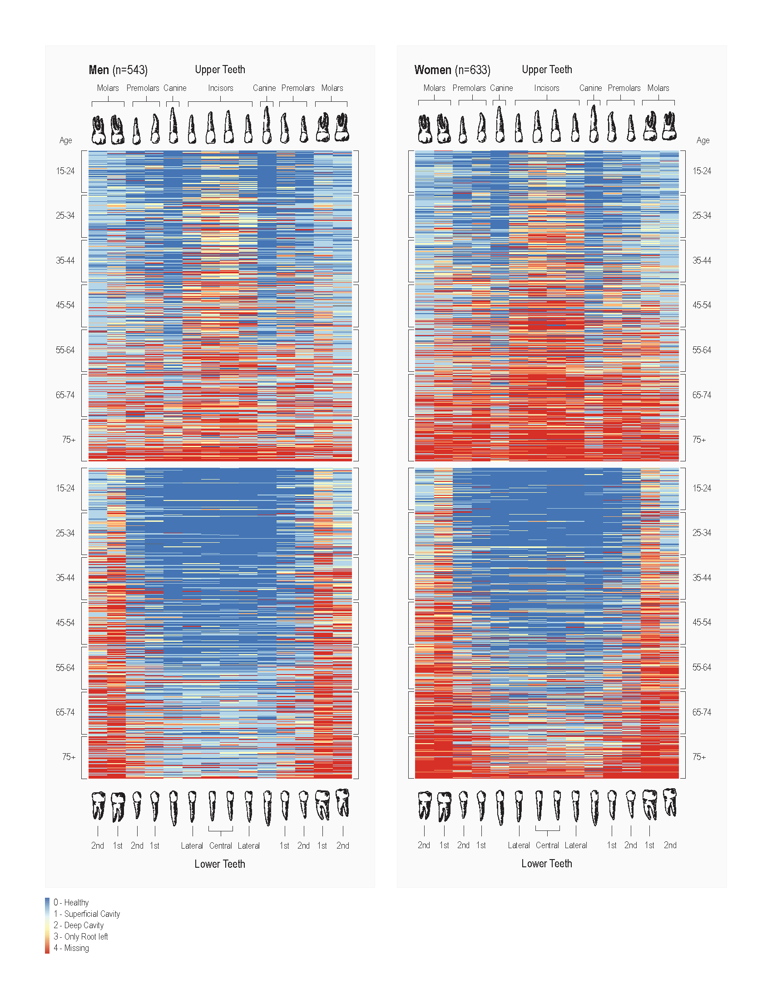

# Data Visualization: A Comprehensive Heatmap of Oral Health in the Tsimane Population

*A heatmap visualization of oral health status across 28 permanent teeth for 1,176 individuals (543 men, 633 women), sorted by age.*

## Project Summary

This figure presents a novel heatmap designed to visually represent the complete oral health status of the Tsimane population of the Bolivian Amazon. The primary challenge was to synthesize a massive, multidimensional dataset—over 32,000 individual data points (1,176 participants × 28 teeth)—into a single, intuitive image. This visualization effectively communicates complex patterns of dental decay and tooth loss across age, sex, and anatomy, making the data accessible to both expert and non-expert audiences.

## Key Features

The solution is a multi-panel heatmap that organizes the data along several clear axes:
- Population: Data is split into two main panels for Men (n=543) and Women (n=633), allowing for immediate comparison.
- Anatomy: Each panel is further divided into Upper and Lower Teeth, showing the distinct patterns of decay for the maxilla and mandible.
- Tooth Type (X-axis): The horizontal axis represents all 28 permanent teeth (excluding third molars), grouped by type: incisors, canines, premolars, and molars.
- Individuals & Age (Y-axis): Each horizontal line represents a single individual. Participants are sorted and grouped by age, from 15-24 to 75+, clearly illustrating the progression of oral health over a lifetime.
- Health Status (Color Scale): A 5-point ordinal color scale indicates the health of each tooth, from Healthy (blue) to Missing (dark red), providing an at-a-glance measure of disease severity.

## Key Insights & Significance

This visualization makes complex trends immediately apparent:

1. Unprecedented Data Density: It successfully displays over 32,000 data points in one coherent image, a feat that would be impossible with traditional charts or tables.
2. At-a-Glance Pattern Recognition: The visual structure allows for rapid identification of key trends, such as:
- Molars and premolars showing the earliest and most severe decay.
- Canine teeth demonstrating remarkable resilience to loss.
- Accelerated decay and tooth loss in older age groups.
3. Clear Progression Over the Lifespan: The vertical sorting by age effectively creates a timeline, showing how oral health deteriorates from young adulthood into old age. This helps identify critical age ranges where interventions might be most effective.
4. Direct Gender and Anatomical Comparison: The side-by-side panel layout highlights subtle but significant differences in oral health patterns. For example, it reveals that Tsimane women tend to experience more severe tooth loss, particularly in the upper incisors, compared to men.
5. Actionable, Tooth-Specific Insights: The granular detail provides specific information on which teeth are most vulnerable, allowing for highly targeted preventative recommendations based on both tooth type and location in the mouth.

